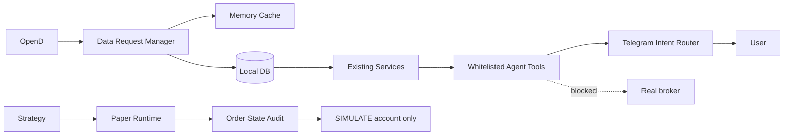

# Agent、Data Gateway 与执行安全加固

本次加固不建立第二套 Telegram、QMR、Paper Trading 或订单系统。它在现有服务上增加统一错误语义、
请求合并、标的身份、受控 Agent 工具和订单安全审计。

## 架构

## Unified Error Layer

`app/core/errors.py` 定义稳定错误码、服务来源、标的、时间、可重试性、严重度和建议动作。底层异常先映射，
用户只看到安全文案；原始异常类型不进入 Telegram。过期、不完整或不可用数据默认阻止新 Entry，不能按
`0 risk` 处理。

## Data Request Manager

`DataRequestManager` 是线程安全的进程内数据请求协调器，支持：

- `(symbol, data_type)` 级缓存；
- 同时请求合并，只让一个调用者执行 loader；
- FRESH / AGING / STALE 元数据；
- 数据源、市场时间、接收时间、年龄、完整度；
- P0 Hard Exit 至 P7 Historical 的配置化优先级。

TTL 位于 `config/data_request_policy_v1.yaml`：正式盘 Quote 10 秒、扩展时段 20 秒、持仓 60 秒、
资金流与市场上下文 300 秒、1m K线 60 秒、基本面 6 小时、标的元数据 24 小时。现有模块可逐步迁移到
该网关；本次没有用一次性重构改变其业务行为。

## Symbol Registry

`symbol_registry` 保存 canonical symbol、资产类型、市场、币种、行业、基准、杠杆和能力声明。
输入 `$APP`、`app`、`US.APP` 均标准化为 `APP`；公司名存在多义时必须返回候选，不自动猜测。

当前明确映射：

- APPX → APP，2x，Software，IGV / XLK；
- MULL → MU，2x，Semiconductors，SOXX / SMH；
- SNDU → SNDK，2x，Semiconductors，SOXX / SMH；
- SOXL / SOXS → SOXX，+3x / -3x，SOXX / SMH。

杠杆交易载体与底层质量主体分开；QMR 基本面不能把杠杆 ETF 当公司财务数据源。

## Agent Skill 与 Telegram

项目 Skill 位于 `skills/trade-companion/SKILL.md`。白名单工具为：

- `analyze_symbol`
- `get_market_context`
- `get_sector_context`
- `get_qmr_analysis`
- `get_money_flow`
- `get_position`
- `get_exit_risk`
- `get_recent_signals`
- `get_paper_orders`
- `record_user_trade`

简单查询走确定性本地工具，不调用模型。复杂解释也必须先取得结构化本地事实，不能由 AI 猜测数据。
回复 QMR 通知时先解析保存的 `signal_id`，再读取 Signal Snapshot 和真实 Paper Order 状态解释“为什么没买”。
每次工具调用写入脱敏审计：chat ID 仅保存 SHA-256。

“帮我买 APP”不会触发任何订单；`record_user_trade` 仅将用户主动报告的数量和成本写入 Portfolio Holding，
并明确标记不是券商成交。

## Order State 与 Paper / Real 隔离

新增的规范化映射覆盖 PENDING_EXECUTION、SUBMITTED、PARTIALLY_FILLED、FILLED、CANCELLED、REJECTED、
FAILED，并拒绝终态倒退。状态变化复用 `SystemPaperAuditEvent`，保存原始 broker status、前后状态和原因。
Moomoo adapter 仍只选择明确 `SIMULATE` 的账户，返回实际 filled quantity、average fill price 和 reject reason。

安全保护有两层：配置必须选择 Paper 模式，adapter 自身必须 `paper_only=true`。无法识别账户或初始化失败时
Fail Closed；执行工厂永不从 Paper fallback 到 Real。Agent 白名单没有创建、修改或取消订单的工具。

## 当前限制

- Data Request Manager 已提供统一入口与合并机制；对所有遗留 OpenD reader 的逐模块迁移应随各模块维护进行，
  本次未做高风险全仓重构。
- 不提供任意 SQL、Shell、原始 Broker API 或真实买卖工具。
- 自然语言以明确的中文/英文规则为主；未识别意图继续使用现有 Telegram 流程。
- 本次没有启用真实交易，也没有改变 Strategy、QMR 或 Paper Runtime 的决策规则。
