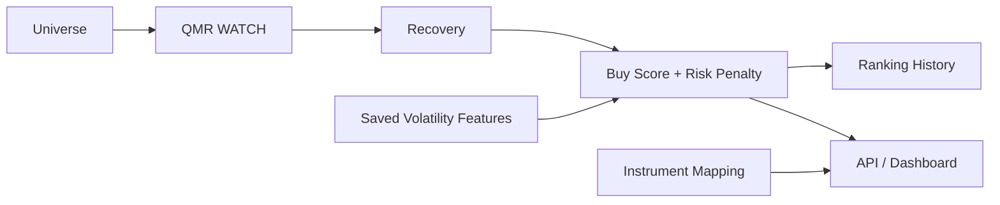

# Buy Score Engine

Buy Score Engine 是 Universe → QMR → Recovery 后的可解释聚合与排序层。它只读取当前模型版本的 QMR `WATCH` 及与该 QMR 记录对应的 Recovery 结果，不重复计算公司质量、错杀、止跌或资金回流指标。

## 评分

原始分由 Quality、Mispricing、Recovery、Sector、Market 和 ETF Importance 加权组成。所有权重、评级阈值、状态阈值、风险参数、追涨参数、迟滞和冷却参数均位于 [`config/buy_score_v1.yaml`](../config/buy_score_v1.yaml)。缺失 Sector、Market 或 ETF Importance 时只对可用输入重新归一化，不用 0 冒充；数据缺失仍会通过 Confidence 和风险项扣分。

风险扣分最大 40，包括：

- 基本面 `HIGH`：硬否决，最终分强制为 0、状态 `REJECT`。
- 大盘恐慌、板块未同步和 Recovery 失败。
- Sprint 2/3 数据可信度不足。
- 已保存 Feature 中的 ATR%、实现波动率，加上 Recovery 保存的日内振幅和 QMR 保存的近期回撤。
- 从首次 Recovery Entry 价格继续上涨过多的 Chase Risk。

输出同时包含 `entry_attractiveness` 与 `recommended_position_confidence`。这两个字段是风险表达，不是仓位分配。

## 状态矩阵

分数先映射为 `WAIT / WATCH / EARLY_ENTRY / CONFIRMED_ENTRY / STRONG_ENTRY`，再受 Recovery Stage 限制：PANIC/STABILIZING 最高只能 WATCH；EARLY_RECOVERY 最高 EARLY_ENTRY；RECOVERY_CONFIRMED 最高 CONFIRMED_ENTRY。FAILED_RECOVERY 强制 WAIT 并进入配置化冷却。低数据可信度或高追涨风险最高只能 WATCH。

迟滞采用降级缓冲和最小状态持续时间，防止 79→81→79 的状态抖动。硬否决不受迟滞阻挡。

这些状态均为“买入候选状态”，不是订单、自动交易或仓位建议。

## 排名与首次发现

排序顺序固定为：最终 Buy Score、Recovery、Mispricing、Quality、Data Confidence、Symbol。每批评分生成独立 `buy_rankings`，记录当前排名、上次排名和变化。`buy_scores` 保存首次 WATCH、EARLY、CONFIRMED 和 STRONG 的价格，历史记录不覆盖。

参考观察区使用 Recovery 当前价、时段高低点，以及可用时已保存的 VWAP/ATR。它是回测基准，不是正式限价指令。`holding_profile` 第一版始终为 `UNKNOWN`。

## 杠杆映射

`instrument_mappings` 和配置初始支持 APP→APPX、MU→MULL、SNDK→SNDU、NVDA→NVDL，并为反向产品保留结构。Buy Score 始终基于底层正股；映射仅展示，不会选择产品、创建订单或改变底层评分。

## 数据库与 API

Migration `0028` 新增：

- `buy_scores`
- `buy_rankings`
- `instrument_mappings`

相同 `symbol + evaluation_time + model_version` 幂等。

- `GET /qmr/buy-scores`
- `GET /qmr/ranking`（默认 Top 20，可请求 Top 10）
- `GET /qmr/{symbol}/buy-score`
- `POST /internal/buy-scores/run`（管理员、默认 dry-run、隐藏 OpenAPI）
- Dashboard：`/dashboard/qmr`

## 运行边界与限制

复用现有 Scheduler，在 Recovery 周期刷新后检查 Buy Score，不扫描全市场。价格新低、VWAP/MACD、板块、大盘或新闻变化必须先形成新的 QMR/Recovery 输入，Buy Score 随后聚合，避免建立第二套指标逻辑。

当前不做自动下单、仓位管理、止盈止损、Telegram 正式交易通知、参数优化或 AI 改分。所有历史参数效果由后续回测验证。
