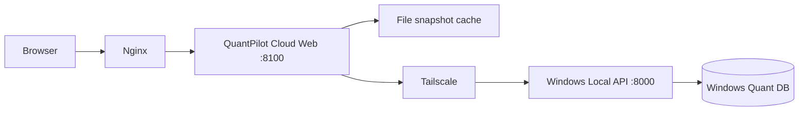

# Cloud Web deployment on the shared IndexLabs server

## Architecture and boundary



Cloud Web is a read-only presentation gateway. It never opens the Windows SQLite file,
runs QMR, submits paper or real orders, starts OpenD, polls Telegram, or starts a market
collector. `IndexLabs` remains in `/www/wwwroot/indexlabs.bio`; QuantPilot uses the
separate `/opt/quantpilot` tree, venv, environment, service and logs.

## Cloud environment

Create `/opt/quantpilot/.env` with mode `0600`. Do not copy the Windows `.env`.

```dotenv
APP_ENV=production
APP_ROLE=cloud_web
APP_HOST=127.0.0.1
APP_PORT=8100
DATABASE_URL=sqlite:////opt/quantpilot/runtime/cloud.db
DASHBOARD_ADMIN_TOKEN=<cloud-login-secret>
DASHBOARD_READONLY_PUBLIC=false
QUANT_NODE_BASE_URL=http://100.111.142.90:8000
QUANT_NODE_API_TOKEN=<windows-local-api-secret>
CLOUD_CACHE_DIRECTORY=/opt/quantpilot/runtime/cloud-cache
REAL_AUTO_TRADING=false
MOOMOO_LIVE_TRADING_ENABLED=false
MOOMOO_ALLOW_ORDER_SUBMISSION=false
MOOMOO_ENABLED=false
REALTIME_RUNTIME_ENABLED=false
RUNTIME_MANAGER_ENABLED=false
PAPER_TRADING_ENABLED=false
PAPER_TRADING_AUTOSTART=false
TELEGRAM_ENABLED=false
TELEGRAM_RUNTIME_ENABLED=false
TELEGRAM_RUNTIME_AUTOSTART=false
UNIVERSE_AUTO_UPDATE_ENABLED=false
QMR_AUTO_UPDATE_ENABLED=false
RECOVERY_AUTO_UPDATE_ENABLED=false
BUY_SCORE_AUTO_UPDATE_ENABLED=false
```

The database setting is retained for settings compatibility only. Cloud mode skips
schema creation and never uses it as a business data source.

## Offline behavior

Successful GET responses are atomically cached as JSON snapshots. Each proxied response
reports `X-Quant-Node-Status`, `X-Data-Freshness` and `X-Source-Timestamp`. If Windows is
offline, cached responses are returned as `STALE`; uncached data returns a safe 503 while
the Dashboard HTML and `/health` continue returning 200. `/health` distinguishes
`cloud_web` from `quant_node` health.

## Installation sequence

1. Record IndexLabs service and HTTP health before changes.
2. Install/join Tailscale without exposing Windows port 8000 publicly.
3. Create the `quantpilot` system account and `/opt/quantpilot`.
4. Clone `FinnZhang666/QuantPilot`, create a dedicated venv, and create the cloud `.env`.
5. Install `deploy/cloud/quantpilot-web.service`, then start only that service.
6. Verify `curl http://127.0.0.1:8100/health` and an SSH-tunnel Dashboard smoke test.
7. Only after a domain is supplied, create a separate Nginx site based on the example.
8. Run `nginx -t`; reload (never restart) Nginx only after it succeeds.
9. Recheck IndexLabs service and HTTP health.

`scripts/deploy_cloud_web.sh` updates only QuantPilot and restarts only
`quantpilot-web.service`. It never touches IndexLabs or Nginx.

## Security

- `/internal/*` is denied both in Cloud middleware and the Nginx example.
- Cloud mode denies every non-GET API request.
- The Quant Node token stays in the server-side `.env`; no response or JavaScript contains it.
- Uvicorn listens only on `127.0.0.1:8100`; UFW must not expose 8100.
- Real trading and live order submission remain disabled.
- TLS configuration must use an independent vhost and certificate after DNS is ready.

## Windows prerequisite

The Windows Local API must listen on its Tailscale address only (or use the existing
Tailscale-only port proxy/firewall rule). Never bind it publicly. Verify from Cloud with
`curl -H 'X-Dashboard-Token: ...' http://100.111.142.90:8000/health` without logging the
token. If it is unavailable, report `WINDOWS_LOCAL_API_TAILSCALE_BIND_REQUIRED`.
