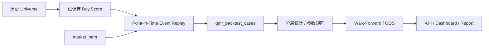

# QMR 历史回测与参数验证引擎

Sprint 5 为 QMR → Recovery → Buy Score 增加独立、可审计的事件研究层。它只回放已持久化的历史评分，不重算或覆盖 Sprint 1–4 的历史结果。

## 时间与成交规则

- 信号事件：某个恢复周期内第一次达到 `EARLY_ENTRY`、`CONFIRMED_ENTRY` 或 `STRONG_ENTRY`。
- 正式评估从信号后的下一根日线开盘开始，避免用收盘后才能确定的信号在同一收盘价成交。
- 收益、MFE、MAE窗口为 1/3/5/10/20 个交易日。
- 局部底部只使用信号前后配置的 5 个交易日，不使用无限未来最低点。
- 同一根K线同时触及止盈和止损时，默认 `STOP_FIRST`，采用保守结果。
- 所有输入快照保存在失败/成功案例中，未来价格仅用于 Outcome 评估，不进入历史信号。



## 数据与接口

Migration `0029` 新增 `qmr_parameter_sets`、`qmr_backtest_runs`、`qmr_backtest_cases`、`qmr_backtest_results` 和 `qmr_walk_forward_results`。参数集不可覆盖，成功与失败案例均保存完整特征快照。

```bash
python -m app.cli qmr-backtest run --start 2020-01-01 --end 2026-08-01 --dry-run
python -m app.cli qmr-backtest run --start 2020-01-01 --end 2026-08-01 --parameter-set default
python -m app.cli qmr-backtest list
python -m app.cli qmr-backtest show --id 1
```

公开只读接口为 `/qmr/backtest/runs`、`/qmr/backtest/runs/{id}`、`/cases` 和 `/results`；内部写接口隐藏于 OpenAPI。Dashboard 为 `/dashboard/qmr-backtest`。

## 统计与可信度

核心统计包含平均/中位收益、正收益率、P25/P75、Profit Factor、Expectancy、序列最大回撤，以及胜率和平均收益的95%置信区间。每个分组显示样本量可信度：`<30 LOW`、`30–99 PRELIMINARY`、`100–299 MEDIUM`、`>=300 HIGH`。

评分等级、买入等级和参数矩阵不会反向修改历史模型。当前 factor ablation 只报告失败特征关联并明确标记为非因果；缺少完整可复算历史特征时不会伪造消融结论。

## Survivorship Bias 与限制

当前 Universe Membership 没有完整 `effective_from/effective_to` 历史。引擎固定输出幸存者偏差警告，并将结论限制为 `RESEARCH`。接入可信历史 QQQ/SPY 成分源前，结果不得称为正式验证或 `VALIDATED`。

分钟级 Recovery 仅覆盖本地已有分钟数据；引擎不下载或复制行情，不调用 AI、OpenD、Broker 或 Telegram，也不修改实时调度。
