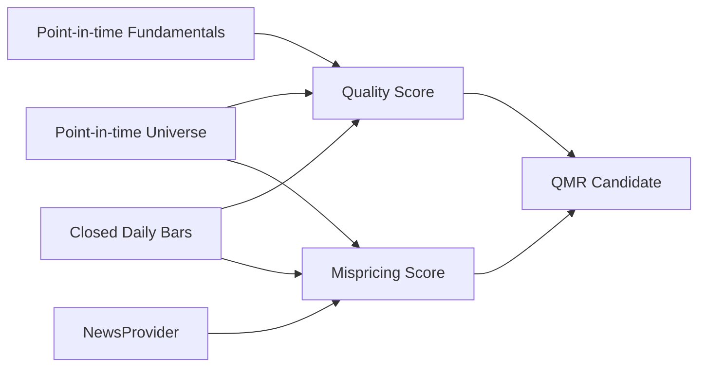

# Quality & Mispricing Engine

QMR Engine 只在 Universe Engine 提供的、评估时点有效的 QQQ/SPY 成分股内运行。它把两个问题分开计算：公司质量是否足够，以及当前下跌相对自身、大盘和行业是否异常。输出仅为 `WATCH`、`NO_SIGNAL` 或 `REJECT`；`WATCH` 不是买入信号，买点判断属于后续 Recovery Engine。

## 评分与配置

所有阈值、权重、异常区间、事件风险折扣和行业基准映射均来自 [`config/qmr_v1.yaml`](../config/qmr_v1.yaml)。默认要求质量分不低于 60、错杀分不低于 65、质量数据覆盖率不低于 65%，且基本面风险不能为 `HIGH`，才输出 `WATCH`。

质量分由盈利能力、成长、现金流与资产负债表、行业质量、ETF 重要性和流动性组成。错杀分由 1/3/5/10/20 日跌幅、历史 z-score/percentile、相对 QQQ/SPY、相对行业 ETF 和事件风险组成。各分项及原始中间值保存于 JSON，便于解释和历史回测。

## 数据来源与 point-in-time 边界

- 股票范围：`universe` 与 `universe_memberships`，按 `first_seen`/`last_seen` 还原评估时点成员关系。
- 价格：本地 `market_bars` 的闭合日线，仅查询 `timestamp_utc <= evaluation_time`。
- 基本面：`fundamental_snapshots`，只读取 `available_at <= evaluation_time` 的最近记录；修订数据必须作为新快照写入，不能覆盖历史可见值。
- 新闻：通过 `NewsProvider` 接口解耦。当前默认 `NoNewsProvider` 不伪造结果，返回 `event_risk=UNKNOWN`、`news_confidence=LOW`。
- 行业基准：按配置尝试读取本地 ETF 日线；没有数据时保持缺失，不用 0 或未来值填补。

当前版本不包含在线基本面或新闻供应商。缺少 point-in-time 基本面时，质量覆盖率不足会使结果成为 `REJECT`；这属于安全降级，不代表公司质量差。未来合法数据供应商应实现现有 Provider 接口并保留来源和可用时间。

## 持久化

Migration `0026` 增加：

- `fundamental_snapshots`
- `quality_scores`
- `mispricing_scores`
- `qmr_candidates`

评分按 `symbol + evaluation_time + model_version` 唯一，重复运行同一时点幂等；新时点追加历史记录，不覆盖旧评分。

## API 与 Dashboard

- `GET /qmr/candidates`：最新候选，支持状态、股票、分页以及 quality/mispricing/combined 排序。
- `GET /qmr/{symbol}`：最新结果、完整评分拆解和历史。
- `POST /internal/qmr/run`：管理员手动运行，默认 `dry_run=true`，内部接口不进入 OpenAPI。
- Dashboard：`/dashboard/qmr`，点击股票进入评分详情。

## 调度

QMR 复用现有 Universe Scheduler，不创建第二套调度器。Universe 按日刷新；QMR 根据 `QMR_UPDATE_INTERVAL_MINUTES` 周期运行。测试环境显式关闭自动更新。单标的失败会回滚该标的事务并继续处理其余标的。

## 当前限制

- 没有可靠新闻源时事件风险为 `UNKNOWN`，不会被当作低风险。
- 行业质量的横截面盈利趋势与全球同行联动尚未实现；数据结构保留对应扩展点。
- 不产生 BUY/SELL、买入价、止损、仓位或通知，也不调用 Broker。

下一 Sprint 可直接读取 `qmr_candidates`，或通过 `GET /qmr/candidates?status=WATCH` 获得等待 Recovery 验证的候选。
