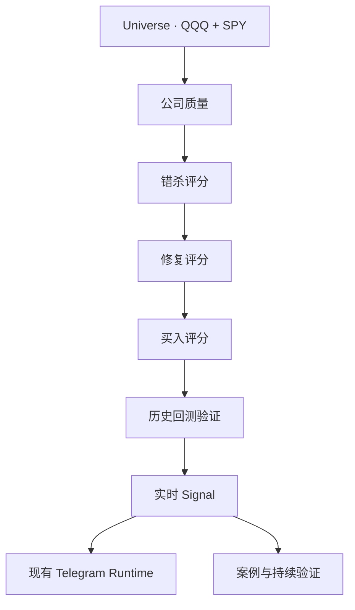

# QMR in Strategy Center

`quality_mispricing_recovery`（优质错杀修复，简称 QMR）是一个完整策略，不是六个独立策略。

## Existing architecture

QMR is registered in the existing `strategies` table as `QMR-v1.0`. The Strategy Center
service is generic: it lists ordinary `StrategyRecord` rows and delegates QMR-specific read
aggregation to the QMR adapter. It does not create another Strategy, Signal, Backtest, Case,
Scheduler or Telegram subsystem.

The association chain is auditable without duplicating data:

- `strategies.code = quality_mispricing_recovery`
- Quality/Mispricing → QMR Candidate → Recovery → Buy Score
- Buy Score → versioned QMR Backtest Run/Case
- Buy Score → versioned QMR Live Signal → Delivery/Performance/Participation
- every backtest and live signal retains its immutable `strategy_version` and parameter set

## Status and controls

The visible statuses are `RESEARCH`, `VALIDATED`, `ENABLED`, `DISABLED`, and `REJECTED`.
The latest successful Sprint 5 validation determines research/validated/rejected state;
the existing `StrategyRecord.is_enabled` is the operational switch. Disabling QMR prevents
new live signals and Telegram strategy notifications while preserving all historical data.

Admin controls:

- `POST /internal/strategy-center/{code}/enable`
- `POST /internal/strategy-center/{code}/disable`

Read APIs:

- `GET /api/strategy-center`
- `GET /api/strategy-center/{code}`

The Dashboard Strategy Center and QMR detail reuse those services. Parameters remain
read-only and are loaded from the existing versioned QMR parameter sets.
