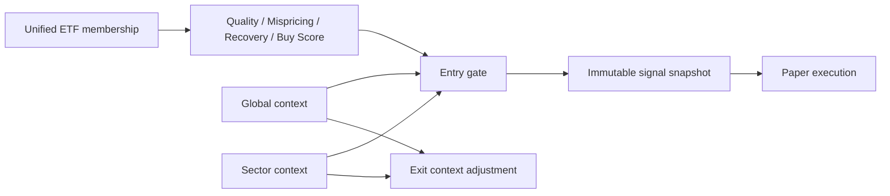

# QMR v1.1 — Market Context and Unified Universe

QMR v1.1 keeps Quality, Mispricing, Recovery and Buy Score unchanged. It adds a
deterministic context gate before paper execution and a context risk adjustment
to the existing Exit Engine. Strategy logic remains separate from execution.

## Unified universe

The automatic scan is the canonical union of active QQQ, SPY, SOXX, SMH, IGV
and IWM memberships. Symbols are normalized and evaluated once. Source ETF
symbols are excluded from company scans. Every result retains
`source_universes` and `source_count`; run output includes raw membership count,
unique count, duplicates removed and per-source availability. Existing
last-known-good membership behavior remains in the Universe Engine. IWM-only
members still pass the stricter small-cap Quality Gate.

## Context model

`market_context_snapshots` stores global cross-asset state and source freshness.
`sector_context_snapshots` stores benchmark relative strength, breadth and
rotation. Missing sources are marked unavailable and reduce coverage; they are
never synthesized. Inputs use 1/3/5/10/20-day returns and persisted closed bars.

Global states are RISK_ON, NEUTRAL, CAUTION and RISK_OFF. Sector states are
STRONG, POSITIVE, NEUTRAL, WEAK and VERY_WEAK. All assets, weights, thresholds,
sector mappings and intervals live in `config/market_context_v1.yaml`.

## Gate, execution and safety

Quality and Recovery are hard gates. Missing/stale context, a closed session,
RISK_OFF or VERY_WEAK sector blocks new entries. CAUTION/WEAK context may only
produce a reduced-size probe. The gate result is persisted in
`QmrLiveSignal.signal_snapshot_json` before a Trade Plan is projected. The Paper
Trading service rechecks the snapshot and applies its position multiplier.

Paper and real routing remain isolated. QMR creates only existing internal paper
ledger orders; `REAL_AUTO_TRADING` stays prohibited. Orders retain the existing
idempotency key and WAITING/FILLED/REJECTED lifecycle. Exit and valuation jobs
run before new entry evaluation.

## Runtime and presentation

Global/sector context is refreshed before scheduled QMR evaluation. Position
monitoring remains the higher-frequency paper-runtime responsibility. Telegram
formatting reads the persisted snapshot and reports global/sector state without
performing a query or sending extra messages. The Dashboard market page exposes
the context as secondary evidence, not as a replacement for stock analysis.

## Historical validation

`MarketContextService.reconstruct()` evaluates each supplied historical time
using bars at or before that timestamp. `compare_context_variants()` compares
baseline, Global-gated and Global+Sector-gated samples. It consumes reconstructed
case outcomes and never reads future bars. A strategy promotion still requires
adequate out-of-sample samples; no performance is fabricated when data is absent.

## Limitations

- Cross-asset symbols not present in the local bar store are DATA_UNAVAILABLE.
- Sector flow is nullable until a verified source is stored.
- No live broker order is created; this release uses the internal paper ledger.
- Context weights are initial research parameters and require historical and
  live paper validation before production promotion.
