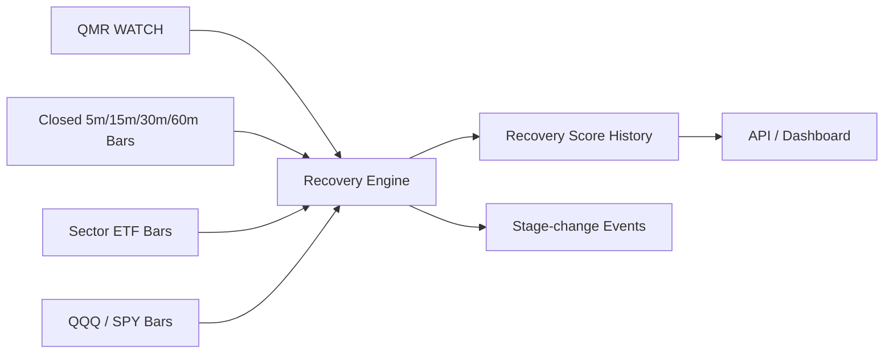

# Recovery Engine

Recovery Engine 只读取当前模型版本下最新的 QMR `WATCH` 候选，用已闭合分钟 K 线判断卖压是否衰竭、资金是否持续回流，以及个股、板块和大盘是否同步修复。它不会重新计算 QMR，也不会扫描 Universe 之外的股票。



## 输出

- `stabilization_score`：不再创新低、ATR 归一化低点修复、Higher Low、VWAP 修复和 EMA5/10/20 结构。
- `capital_flow_score`：同交易时刻累计 RVOL、上涨/下跌成交量、VWAP 与量能、价格成交量背离和连续资金流。
- `technical_score`：30 分钟 MACD DIF/DEA/Histogram 与 RSI 回升，仅作为确认因子。
- `sector_recovery_score`：配置化行业 ETF 的同步修复。
- `market_recovery_score`：QQQ/SPY 环境，映射为 PANIC、STABILIZING、RECOVERY 或 NORMAL。
- `global_context_score`：第一版保留接口；没有可靠数据时为 `UNKNOWN`，不默认安全。

最终 Recovery 权重、每个分项权重、阶段阈值、Entry 阈值、RVOL 和失败阈值全部位于 [`config/recovery_v1.yaml`](../config/recovery_v1.yaml)。任何单一 RSI、MACD、跌幅或 VWAP 条件都不能单独产生 Entry。

## 状态机与失败

```text
PANIC → STABILIZING → EARLY_RECOVERY → RECOVERY_CONFIRMED → TREND_RECOVERY
                                                               ↓
                                                        FAILED_RECOVERY
```

Entry 状态为 `WAIT / OBSERVE / EARLY_ENTRY / CONFIRMED_ENTRY / STRONG_ENTRY / FAILED`。若已有 Entry 后重新跌破信号前低及配置容差，立即记录 `FAILED_RECOVERY + FAILED` 和失败原因。`recovery_events` 只在 Stage 或 Entry 状态变化时追加，`recovery_scores` 保留每个评估时点的完整评分。

Entry 是“买点候选状态”，不是订单、仓位建议或自动交易指令。

## Point-in-time 与交易时段

- QMR 候选、所有个股/ETF/大盘 K 线均限制 `timestamp <= evaluation_time`。
- 只读取 `market_bars`，不读取未闭合的 `realtime_bars`。
- RVOL 按 `market_session` 和同一交易时刻累计量对比过去 20 个交易日，不混用夜盘、盘前、正常盘和盘后。
- 无主动买卖/大单来源时 `capital_flow_data=PARTIAL`，该因子保持缺失，其余可用因子重新归一化，并降低 `data_confidence`。
- 板块、大盘或技术数据缺失时保持缺失，不使用 0、前值、后值或未来值填充。

## 数据库与接口

Migration `0027` 新增：

- `recovery_scores`
- `recovery_events`

同一 `symbol + evaluation_time + model_version` 幂等。

- `GET /qmr/recovery`
- `GET /qmr/recovery/{symbol}`
- `POST /internal/recovery/run`（管理员，默认 dry-run，隐藏于 OpenAPI）
- Dashboard：`/dashboard/qmr`，股票详情显示评分解释、数据覆盖和风险。

## 调度与隔离

复用现有 Universe Scheduler，根据 `RECOVERY_UPDATE_INTERVAL_MINUTES` 定期检查，不创建冲突调度器。它逐股票提交；单个标的失败不会终止其余候选。测试环境关闭自动运行。

## 当前限制

- 没有可靠逐笔主动买卖和大单数据，因此默认资金数据为 `PARTIAL`。
- 全球半导体联动只有配置接口，尚无可靠 point-in-time 数据时返回 `UNKNOWN`。
- 当前恢复结构使用已有分钟 K 线，不使用 Tick 回放。
- 不执行自动下单、仓位管理、正式 Telegram 买入通知或参数优化。

后续回测可按模型版本读取 `recovery_scores` 与 `recovery_events`，还原首次 Entry 和失败时点。
