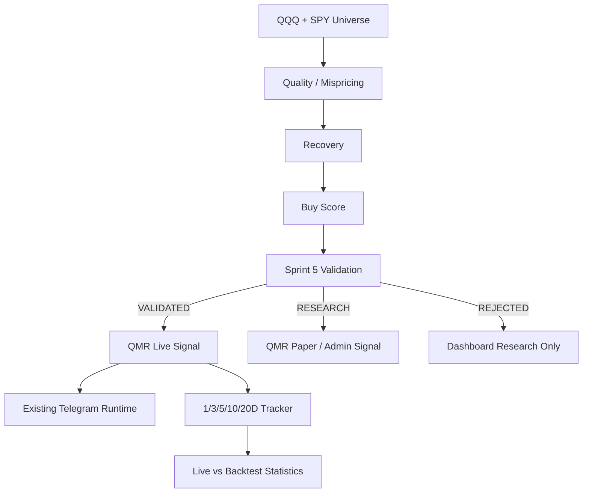

# Sprint 6 — QMR Live Signal & Telegram Integration

## Boundary

QMR Live reuses the existing Telegram long-polling runtime, bot registry, authorization,
transport, feedback records, scheduler, Dashboard and market-session data. It does not
submit broker or paper orders and it does not create a second Telegram runtime.

## Flow

## Signals and delivery

IDs use `QMR-YYYYMMDD-NNN` based on America/New_York. Only a first
`EARLY_ENTRY`, an upgrade to `CONFIRMED_ENTRY` or `STRONG_ENTRY`, and a later
invalidation are notification events. The database unique key
`signal_id + chat_id + event_type` makes delivery idempotent across restarts.
The signal is committed before Telegram is called, so a transport failure cannot lose it.

Telegram messages show the conclusion, score, price and risk first. Historical similarity
comes only from the latest successful Sprint 5 run. Missing statistics are explicitly
unavailable and samples below 30 carry a warning. Reply-to-message lookup uses the saved
Telegram message ID and never asks AI to guess market facts.

## Feedback and participation

Helpful/not-helpful reuses `telegram_feedback`; one user and signal has one current
rating. “I bought” creates an idempotent QMR participation record with
`entry_price_source=SIGNAL_REFERENCE` unless a real fill is supplied in a later Sprint.
User experience metrics remain separate from objective signal returns.

## Continuous validation

Closed daily bars generate 1/3/5/10/20-day return, MFE and MAE records. Rolling 20/50/100
and all-time statistics compare live 5-day win rate with the immutable Sprint 5 result.
Drift is reported but never changes strategy parameters. Case labels retain winners and
failures: `MAJOR_WINNER`, `OUTLIER_WINNER`, and `FALSE_RECOVERY`.

## API and Dashboard

- `GET /qmr/live-signals`
- `GET /qmr/live-signals/{signal_id}`
- `GET /qmr/live-signals/statistics`
- hidden admin: `POST /internal/qmr/live/run`
- hidden admin: `POST /internal/qmr/live/track`
- `/dashboard/qmr-live`
- `/dashboard/qmr-live/{signal_id}`

All database timestamps are UTC. User-facing QMR Telegram times are ET and include the
overnight, pre-market or after-hours label when applicable.
