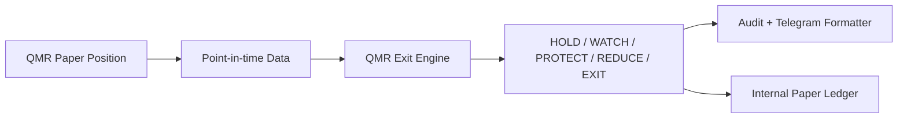

# Sprint 9 — QMR Exit Engine

## 定位与边界

Exit Engine 是 `quality_mispricing_recovery`（QMR v1.0）的子模块。它不改变 Entry Score，
不创建第二套 Strategy、Telegram、Backtest 或持仓模型。输出仅用于建议、内部 Paper 账本和研究；
真实自动交易保持关闭。

## 配置和评分

唯一参数源是 `config/qmr_exit_v1.yaml`。六个子分数先归一化到 0–100，再按以下权重合成：

| 因子 | 权重 | 主要证据 |
|---|---:|---|
| Capital Flow Risk | 25 | 1/3/5/10 日订单规模结构、资金与价格背离 |
| Trend Deterioration | 20 | Daily/60m/30m EMA、MACD、ATR 与结构恶化 |
| Relative Strength | 15 | 相对 SPY、QQQ、行业基准的 1/3/5/10/20 日收益差 |
| Sector Rotation | 15 | 行业基准 1/3/5 日排名及持续下降 |
| Profit Protection | 15 | 阶段化浮盈、giveback、ATR/波动调整保护距离 |
| Price/Volume Exhaustion | 10 | 放量滞涨、冲高回落、价量/动量背离 |

默认状态阈值为 `<30 HOLD`、`30–44 WATCH`、`45–59 PROTECT`、`60–74 REDUCE`、
`>=75 EXIT`。REDUCE 默认为 1/3；高风险组合可提升至 1/2。少量 Hard Exit 仅用于原始结构低点
有效跌破等明确失效，并保存 `hard_exit_reason`。

## Money Flow Structure

Moomoo SDK 的 `get_capital_distribution` 可提供特大/大/中/小单流入和流出；应用的只读 Provider
据此保存各档原始值及净额。`get_capital_flow` 另可提供各档净流和 main flow，但本版采集器不混合
两个不同时间口径。大单只称为 *institutional proxy*，用户文案使用“疑似吸筹/派发/承接”。

分类包括 `ACCUMULATION`、`DISTRIBUTION`、`BROAD_BUYING`、`BROAD_SELLING`、
`POSSIBLE_ABSORPTION`、`NEUTRAL`。它必须与价格拒跌、低点、VWAP/量价证据联合使用，不能独立触发
BUY 或 EXIT。API 不可用、成交额为零或字段不完整时保存 `data_available=false`，退出评分重新按可用
权重归一化并降低 confidence，绝不把缺失值当成零风险。

## Point-in-time 与回测

Repository 的 K 线、资金快照及基准查询均限定 `timestamp <= evaluation_time`。回测逐根使用前缀数据，
比较固定 5 日、固定 10 日、+10% 退出、传统止盈止损和 QMR Exit Engine，并保存退出原因、MFE、MAE、
giveback 与 `captured_mfe_ratio = realized_profit / maximum_favorable_profit`。预设案例仅用于统一规则
验证，不允许按 APP、MU、NOK、SOXL、SPCX 或 SNDU 手工调参。

## Universe v2

配置新增 CORE（SPY/QQQ）、INDUSTRY（SOXX/IGV；SMH 保留可配置但未启用不稳定下载端点）和
SMALL/MID（IWM）层。Universe 仍按标准化 symbol 去重。IWM-only 标的必须额外通过市值、美元成交额、
盈利、现金流、负债和稀释检查；数据不足即排除，不降低 Quality Gate。

## Paper、安全与限制

QMR Live Signal 可幂等投影为现有 CandidateSignal/TradePlan，既有 System Paper Runtime 根据评分分层
确定内部账本仓位，并仅在 REDUCE/EXIT 状态变化时模拟成交。订单 idempotency key 防止重复执行；组合
行业上限在入场前检查。当前实现不会连接真实券商，也不会把 Paper 路由到 REAL。

当前限制：Moomoo Paper Broker Adapter 仍是安全占位，尚未在 Windows/OpenD 模拟账户完成真实 API
提交、部分成交和拒单联调。因此“自动 Paper Trading”当前指 Trade Companion 内部可审计账本，不能
声称 Moomoo 模拟账户订单已成交。SMH 暂无已验证稳定的官方机器下载 URL；资金流可用性依赖 OpenD、
权限和市场时段。
