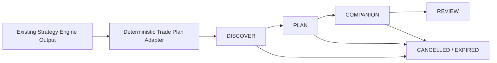

# Sprint 30: Trade Lifecycle Foundation

## Purpose

Trade Lifecycle structures existing Strategy Engine output into a traceable
Trade Plan. The Strategy Engine remains the sole source of decision semantics.
The lifecycle layer does not score, calculate a signal, derive price levels,
send an order, or call an AI provider.

## Domain model

The typed lifecycle stages are:

- `DISCOVER`
- `PLAN`
- `COMPANION`
- `REVIEW`
- `CANCELLED`
- `EXPIRED`

Normal forward transitions are strictly `DISCOVER -> PLAN -> COMPANION ->
REVIEW`. `DISCOVER`, `PLAN`, and `COMPANION` may terminate as `CANCELLED` or
`EXPIRED`. Terminal states and `REVIEW` do not allow arbitrary jumps.

A Trade Plan records its UUID, symbol, market, strategy identity, optional source
Signal, lifecycle stage, direction, timeframe, timestamps, optional reference
and planning levels, Strategy score/confidence, status, source snapshot, user
participation status, and review status.

Missing levels remain SQL `NULL` or an empty target list. User-facing formatters
render them as `暂无（策略未提供）`; no undocumented formula supplies a value.

## Persistence

Alembic revision `0015` adds two SQLite-compatible tables:

- `trade_plans`
- `trade_plan_transitions`

The migration is additive and reversible. Existing Signal, Opportunity,
historical data, Feature, Strategy, Review, and Research tables are untouched.
Each transition stores previous/new stage, timestamp, reason, source, and
optional metadata. Initial creation is itself an auditable transition.

## Strategy adapter

`TradePlanAdapter` consumes an existing `CandidateSignal`. It deep-copies the
original summary, reasons, risks, Feature references, components, identifiers,
score, confidence, and parameter hash into source metadata. It does not mutate
the Signal.

The current long-only strategy maps an existing `CANDIDATE_BUY` to `LONG`.
Explicit `SHORT` input is supported for future upstream strategies and tests,
but no real SHORT output is manufactured. Other signal types do not create a
new plan. Existing Strategy Engine output does not contain structured entry,
add-on, breakout, stop, or target levels, so those fields remain unavailable.

## Service

`TradeLifecycleService` owns creation, idempotency, lookup, filtered listing,
transition validation, cancellation, expiry, and transition history. Lifecycle
logic is not embedded in API, Dashboard, or Telegram code.

No public mutation endpoint is provided in Sprint 30. Internal callers may use
the service in a later approved integration Sprint.

## Read-only API

- `GET /api/trade-plans`
- `GET /api/trade-plans/{plan_id}`
- `GET /api/trade-plans/{plan_id}/history`

List filters include symbol, lifecycle stage, plan status, strategy, market,
date range, limit, and offset. Existing endpoint contracts are unchanged.

## Dashboard

`/dashboard/trade-plans` uses the existing Dashboard shell and table design. It
shows symbol, stage, strategy, reference price, buy zone, stop loss, targets,
status, and creation time. It is read-only and contains no order controls.

## Telegram preparation

`format_trade_plan()` produces a reusable structured text representation with
reference price, three optional zones, stop, targets, invalidation, and strategy
identity. It does not send a message and does not add or modify any Telegram
command, callback, menu, or conversation flow.

## Release notes: 0.9.1-beta

- Added typed and validated Trade Lifecycle stages.
- Added deterministic Candidate Signal to Trade Plan adapter.
- Added additive Trade Plan and transition-history persistence.
- Added read-only API and Dashboard foundation.
- Added a non-sending Telegram formatter.

## Limitations and future integration

- No automatic creation hook is connected to Strategy Runtime in this Sprint.
- Existing Strategy output does not provide price zones; all such values remain
  unavailable.
- User participation is represented but no user mutation flow exists.
- Review integration is represented but does not change the existing Review
  Engine.
- No AI, OpenD, scheduler, broker, simulated execution, or real execution logic
  is added or modified.
