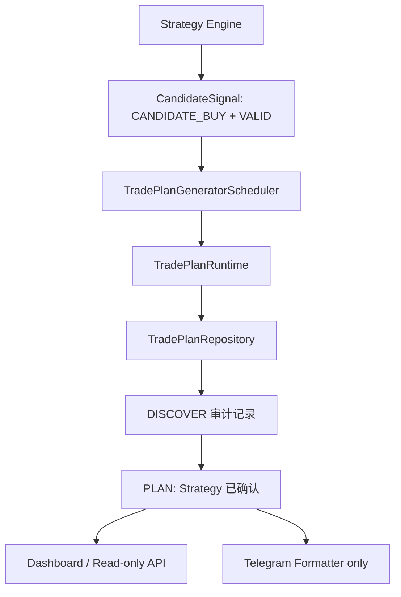

# Sprint 31：Trade Plan Runtime

Trade Companion 0.9.2-beta 开始从既有 Strategy Signal 自动生成真实 Trade Plan。
本层只消费 Strategy Engine 输出，不修改评分规则，也不执行交易。

## 去重与幂等

- Runtime 只扫描 `CANDIDATE_BUY + VALID` 且尚无 Plan、或仍处于 `DISCOVER` 的 Signal。
- `trade_plans(signal_id, direction)` 数据库唯一约束是最终一致性保护。
- CandidateSignal 自身已用标的、市场、周期、K线时间、策略版本和参数 Hash 标识策略输出，
  因此同一 Signal 不会生成第二个有效 LONG Plan。
- 重复 Scheduler、API 或 Runtime 执行不会新增 Plan 或转换历史。

## 生命周期

创建时先写入 `DISCOVER` 及其审计事件。现有 CandidateSignal 已代表 Strategy Engine
确认，所以 Runtime 随即用独立转换事件推进到 `PLAN`。Sprint 31 不进入 `COMPANION`；
该阶段需要后续用户参与。

## Repository 与 Runtime

`TradePlanRepository` 统一负责 Signal 读取、Plan CRUD、搜索、计数、转换历史和事务。
API、Service 和 Runtime 不直接构造 Trade Plan ORM 查询。单个 Signal 失败会回滚该次事务、
记录结构化错误，并继续处理其他 Signal。

## Scheduler

现有 Realtime Opportunity Runtime 循环触发轻量 `TradePlanGeneratorScheduler`。Scheduler
使用非重叠后台线程、每批最多 100 条；停止 Runtime 时安全等待当前批次。它复用现有循环频率，
没有新增或改变调度间隔。

## API 与 Dashboard

- `POST /internal/trade-plans/generate`：管理员 Token 鉴权，供内部运行；`limit` 为 1～1000。
- `/dashboard/trade-plans`：展示真实 Plan 列表。
- `/dashboard/trade-plans/{plan_id}`：展示价格区间、止损、目标和完整生命周期历史。

页面无买卖、跟单或生命周期写入按钮。既有 `/api/trade-plans` 查询保持只读。

## Telegram Formatter

Formatter 直接接受持久化 `TradePlan`，输出标的、方向、阶段、参考价、Buy/Add-on/Breakout
Zone、止损、目标、可信度和生成时间。macOS 不启动 Polling、不发送消息；真实 Bot 联调仍在
Windows 完成。

## 双机开发规则

- macOS：开发、测试、Commit；本 Sprint 按要求不 Push。
- Windows：部署、OpenD 和 Telegram 真实联调。
- Windows 修复必须 Commit + Push；Mac 下一次开发前先 Pull，禁止双机并行开发不同功能。

## Release Note — 0.9.2-beta

新增 Trade Plan Repository、幂等生成 Runtime、实时循环触发器、内部生成 API、真实
Dashboard 详情页和完整 Formatter 字段。Strategy Engine、OpenD、数据库结构、公开 API 和
交易安全边界均未改变。
