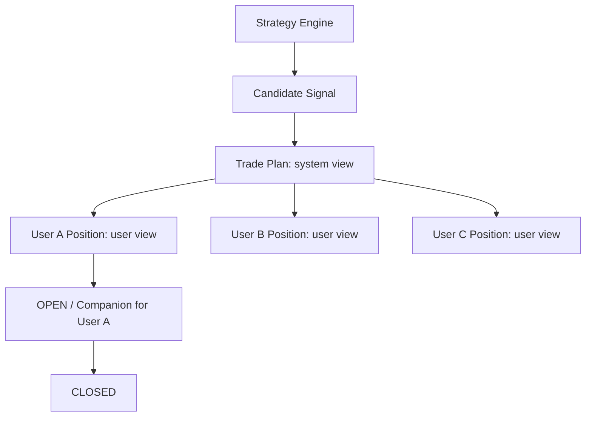

# Sprint 32：User Participation Engine

Trade Companion 0.9.3-beta 增加独立的用户参与层。Trade Plan 始终代表系统计划；
User Position 始终代表具体用户的行为，两者不会互相覆盖。

## 数据模型

Migration `0016` 新增 `user_positions`：保存 `user_id`、来源 `trade_plan_id`、标的、方向、
用户自己的进入价格、可选数量、打开/关闭时间、退出价格、状态、来源和笔记。价格使用 Numeric，
所有时间带 UTC 语义。一个 Trade Plan 可关联多个用户；同一用户不能同时重复参与同一 Plan，
平仓后可以重新参与。

没有修改 `trade_plans`，也没有使用其兼容字段保存用户状态。用户参与仅把自己的实例置为
`OPEN`（用户视角的 Companion）；系统 Trade Plan 仍保持 `PLAN`。

## Repository 与 Service

`UserPositionRepository` 统一负责 Create、Update、Close 所需持久化、Exists、List、Get、
分页计数与基础统计。`UserParticipationService` 验证：

- 来源 Plan 必须存在、有效并处于 `PLAN`；
- entry/exit 必须大于 0，quantity 可空但填写时必须大于 0；
- 平仓时间不能早于参与时间；
- 关闭操作不会修改 Strategy、Signal 或 Trade Plan。

统计仅包含 Open Positions、Closed Positions、Total Trades、Win Count 和 Loss Count。
Sprint 32 不计算收益率、MFE 或 MAE。

## API

只读接口：

- `GET /api/user-positions`
- `GET /api/user-positions/{id}`
- `GET /api/user-positions/statistics`

管理员内部接口（不显示在 OpenAPI）：

- `POST /internal/user-positions/open`
- `POST /internal/user-positions/close`

内部接口只记录用户声明，不调用任何券商或订单能力。

## Dashboard

`/dashboard/positions` 展示 My Positions 和基础统计；`/dashboard/positions/{id}` 展示用户
进入/退出记录、笔记以及只读的来源 Plan、Lifecycle、Stop Loss 和 Targets。页面没有“我买入”
按钮，也没有真实交易操作。

## Telegram Callback 数据

`trade_plan_participation_callbacks()` 只生成符合 Telegram 64-byte 限制的数据：

- `participation:open:{plan_id}`
- `participation:ignore:{plan_id}`
- `participation:watch:{plan_id}`

本 Sprint 不注册 Callback Handler、不发送消息、不启动 Polling。真实 Bot 链路留给 Windows 联调。

## 安全边界

Strategy Engine、Candidate Signal、Trade Plan Runtime、Scheduler、OpenD、Telegram Runtime、
Review Engine 均未修改。本层不会自动下单，不接 Broker，不计算投资绩效。
