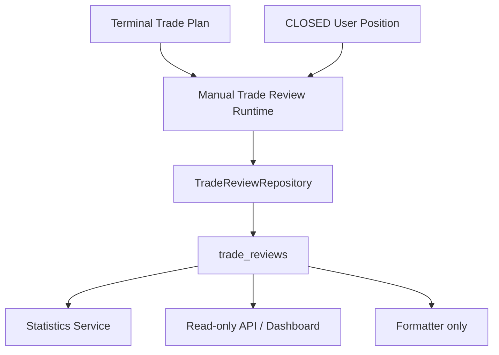

# Sprint 33：Review Engine Foundation

Trade Companion 0.9.4-beta 建立唯一的客观 Trade Review 基础。它读取已保存的 Trade Plan、
已结束的 User Position 和现有 Historical Bars，不参与交易决策，也不调用 AI。

## Review 生命周期与资格

- System Review：Trade Plan 只有进入 `REVIEW`、`CANCELLED` 或 `EXPIRED` 后才有资格。
- User Review：User Position 只有处于 `CLOSED` 且具有退出价格和时间时才有资格。
- `PLAN`、`COMPANION` 和 `OPEN` 对象不会进入最终 Review 扫描；直接指定生成也会二次拒绝。
- Review 生成不会修改 Trade Plan、User Position、Candidate Signal 或 Strategy。

## 数据模型与幂等

Migration `0017` 新增 `trade_reviews`。每条记录包含来源 Plan、可选 User Position、类型、
客观结果、Entry/Exit、MFE、MAE、Holding Minutes、Target/Stop 命中与 Review Time。

稳定唯一键为 `SYSTEM:{trade_plan_db_id}` 或 `USER:{user_position_id}`。重复 Backfill 会更新原
Review，而不会产生第二条记录。System 与 User Review 相互独立，因此同一 Plan 可以同时具有
一条系统结果和多个用户结果。

## Runtime 与 Backfill

`TradeReviewRuntime.generate_review()` 处理单个来源；`generate_reviews()` 批量扫描结束对象。
支持：

- 默认 `dry_run=true`；
- 显式 write（`dry_run=false`）；
- `limit`（1～1000）；
- `symbol`、`strategy`、`start_time`、`end_time`；
- 单个来源失败隔离；
- `scanned / created / skipped / updated / failed` 统计。

本 Sprint 不接入 Scheduler。Runtime 只通过管理员内部 API 手工触发。

## MFE / MAE 公式

数值以百分比点保存，例如 `5.25` 表示 `5.25%`。

LONG：

- `MFE = max(0, highest_high / entry - 1) × 100`
- `MAE = min(0, lowest_low / entry - 1) × 100`

SHORT：

- `MFE = max(0, 1 - lowest_low / entry) × 100`
- `MAE = min(0, 1 - highest_high / entry) × 100`

只读取相同 symbol/timeframe、`FORWARD + MOOMOO` 的现有 `market_bars`，范围为 Entry Time
至结束时间（含边界）。不使用 Tick、不做 Tick Replay、不重建更细分钟路径。

## Target、Stop 与结果

Target 使用 Trade Plan 已保存的第一个目标，Stop 使用已保存 Stop Loss；缺失时保持未命中，
不推导价格。LONG 使用 High 判断 Target、Low 判断 Stop；SHORT 相反。

User Review 按用户 Entry/Exit 和方向分类 `WIN/LOSS/BREAKEVEN`。System `REVIEW` 使用 Plan
Reference 与区间最后历史 Close；`CANCELLED/EXPIRED` 保留对应客观终态。

## Statistics

统计服务仅聚合：

- System：Total Reviews、Wins、Losses、Breakeven；
- User：Closed Positions（已有 User Review）、Wins、Losses、Breakeven。

不计算 CAGR、Sharpe、Sortino、Kelly、收益率或排名。

## API 与 Dashboard

只读：`GET /api/reviews`、`GET /api/reviews/{id}`、`GET /api/reviews/statistics`。
管理员内部：`POST /internal/reviews/generate`，默认 dry-run 且不显示在 OpenAPI。

Dashboard `/dashboard/trade-reviews` 展示 Overview 与 Review 列表；详情页展示来源、Entry/Exit、
MFE/MAE、Holding、Target 和 Stop。页面没有写操作或交易按钮。

## Telegram 边界

仅提供 Trade Review Formatter。未修改 Commands、Polling、Webhook 或 Bot Runtime，没有发送消息。
