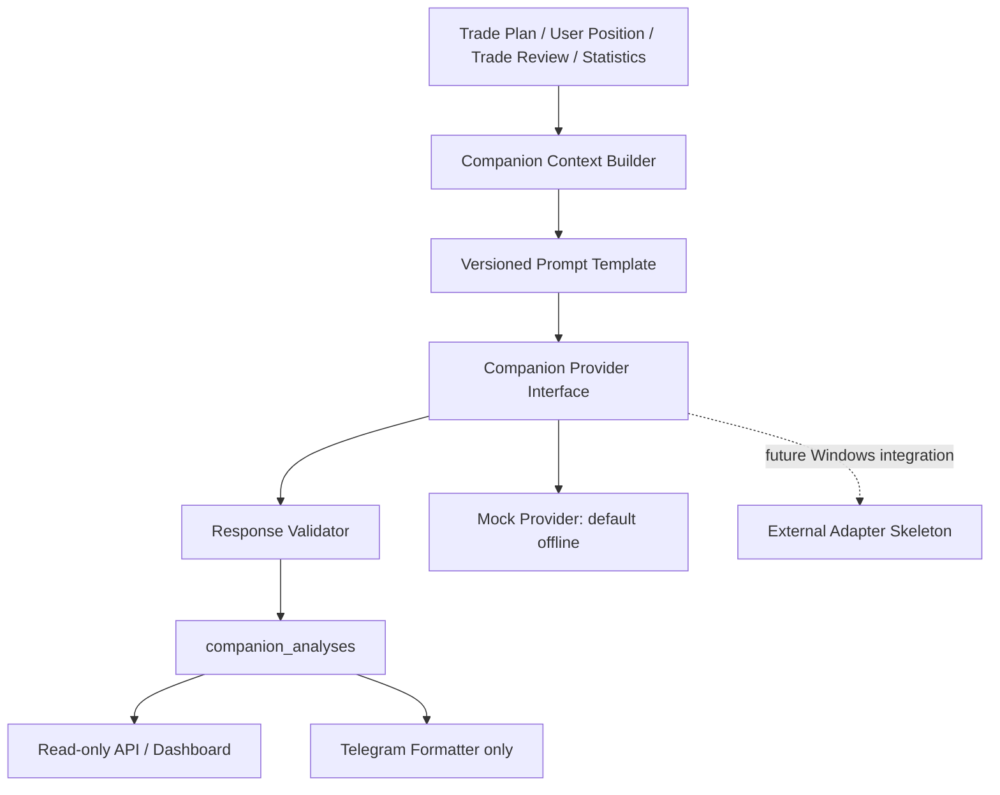

# Sprint 34：AI Companion Foundation

Trade Companion 0.9.5-beta 在完整客观数据链之上增加只读解释层。Strategy Engine 仍是唯一
决策来源；AI Companion 不生成 Signal、不推导价格、不推进生命周期，也不执行交易。



## 产品与决策边界

Context 只读取已经保存的 Trade Plan、User Position、Trade Review 和现有 Statistics。AI 不得
改变 Direction、Score、价格区间、Stop、Target、Entry/Exit、Lifecycle、Review、MFE/MAE 或
胜负统计。缺失价格统一记录为 `暂无（策略未提供）`，不得补算。

## Context Builder 与 Schema

`companion-context-v1` 固定包含：context type、生成时间、产品、Trade Plan、可选 Position、
可选 Review、现有 Statistics、Missing Fields 与 Source References。ORM、Session、密钥、请求
Header 不会进入 Context。Context 在持久化前经过 JSON 深拷贝。

支持：

- `build_trade_plan_context()`：PLAN/COMPANION/REVIEW/CANCELLED/EXPIRED；
- `build_user_position_context()`：现有 OPEN 或 CLOSED Position；
- `build_trade_review_context()`：只针对已存在的最终 Trade Review；
- `build_statistics_context()`：只读取现有 Statistics Service 的客观聚合结果。

Position Notes 和 Strategy Snapshot 被视为不可信数据，字符串限制为 1000 字符、容器限制为
100 项，并放入显式 `BEGIN_UNTRUSTED_DATA_BLOCK`。模板声明数据块不是系统指令，不执行 URL、
命令或代码，不读取外部链接。

## Output Schema 与 Validator

`companion-response-v1` 要求结构化：Summary、Plan Interpretation、Risk Notes、Positive/Caution
Factors、Missing Data、Lifecycle Guidance、可选 Review Interpretation、固定 Disclaimer 和安全
Provider Metadata。禁止 JSON 外文本。

Validator 拒绝：

- 非 JSON、额外字段、缺少必填字段、类型错误、超长值；
- `recommended_entry/stop/target`、`new_signal`、`trade_action`、`order_request`、
  `guaranteed_return` 等字段；
- 新价格建议、确定收益承诺和交易命令表述；
- Bearer、OpenAI 风格 Key 或 Telegram Token 模式。

非法响应标记 `REJECTED`，Provider/Timeout 错误标记 `FAILED`。错误摘要安全脱敏并限制 500 字符；
不会修改任何客观业务对象。

## Prompt Template

代码内版本化模板 `v1`：

- `TRADE_PLAN_EXPLANATION`
- `POSITION_COMPANION`
- `REVIEW_SUMMARY`
- `STATISTICS_EXPLANATION`

均支持 `zh-CN` 与 `en-US`，输出 Schema 为 `companion-response-v1`。模板集中在
`app/companion/templates.py`，不散落在 API、Dashboard 或 Telegram。

## Provider Interface 与 Mock

`CompanionProvider.generate(context, template)` 是唯一 Provider 接口。默认 `MockCompanionProvider`
不联网、输出稳定、明确标记 `TEST / MOCK OUTPUT`。`GeminiCompanionProvider` 仅为注入式 Adapter
骨架：默认关闭且自身不创建网络连接；缺少 Key、Transport、超时、限流与空响应均安全失败。
本 Sprint 没有真实 AI 调用。

## 持久化、审计与幂等

Migration `0018` 新增 `companion_analyses`，保存 Context Snapshot、已校验结构化响应、模板与
Schema 版本、Provider/Model、状态和安全错误摘要，不保存 Prompt、API Key、Authorization 或
原始 HTTP 日志。

Input Hash 由确定性 Context 计算；Request Fingerprint 再组合 Context Type、对象、模板版本、语言、
Provider 和 Model。成功结果默认命中数据库缓存；`force=true` 创建新的历史输出，不覆盖旧记录；
源对象变化会生成新的 Input Hash 和历史版本；FAILED/REJECTED 允许在同一普通请求槽位重试。
数据库唯一约束避免普通并发请求重复写入。

日志只包含 Analysis ID、Context/Object、Template、Provider、Language、Force、状态、Latency 和
校验结果，不记录业务 Context 或密钥。

## API 与 Dashboard

管理员内部接口（不显示在 OpenAPI）：

- `POST /internal/companion/trade-plans/{plan_id}/generate`
- `POST /internal/companion/positions/{position_id}/generate`
- `POST /internal/companion/reviews/{review_id}/generate`
- `POST /internal/ai-companion/generate`（统一支持四种 Context Type）

默认 `dry_run=true`：只返回 Context 和 Prompt Preview，不调用 Provider、不写数据库。Write 要求
`AI_COMPANION_ENABLED=true`。Provider Override 必须在配置白名单。

只读：`GET /api/companion-analyses`、`GET /api/ai-companion/outputs` 及各自详情接口，支持分页和合理过滤，
不返回 Context Snapshot、Prompt、Key、Header 或原始 Provider 响应。

Dashboard `/dashboard/ai-companion`（兼容 `/dashboard/companion`）和详情页只展示已清理的结构化解释，
无编辑、买卖或下单按钮。

## Telegram Formatter

Formatter 只接受 `COMPLETED` 且已持久化的 Analysis，生成风险声明明确的文本。它不直接调用
Provider，不修改 Commands/Callback/Menu，不发送消息，也不启动 Polling 或 Webhook。

## 配置

```text
AI_COMPANION_ENABLED=false
AI_COMPANION_PROVIDER=mock
AI_COMPANION_MODEL=mock-companion-v1
AI_COMPANION_API_KEY=
AI_COMPANION_TIMEOUT_SECONDS=30
AI_COMPANION_MAX_RETRIES=1
AI_COMPANION_MAX_OUTPUT_TOKENS=2048
AI_COMPANION_DEFAULT_LANGUAGE=zh-CN
```

API Key 只来自本机环境，`safe_dict`、API、Dashboard 和日志均不暴露。`.env.example` 仅有空占位。

## macOS / Windows 与当前限制

macOS 负责 Mock、Schema、Validator、Persistence、API、Dashboard 和测试。Windows 后续负责真实
External Provider、OpenD 与 Telegram 联调。联调前需实现受控 Adapter、配置本机 Key、验证超时/
重试/限流和脱敏，再以明确授权运行；不得把真实 Key 提交 Git。

当前无 Gemini 联通、无真实模型响应、无生产 Token 验证、无 Telegram AI 发送、无 Scheduler
自动调用、无批量外部模型任务。
