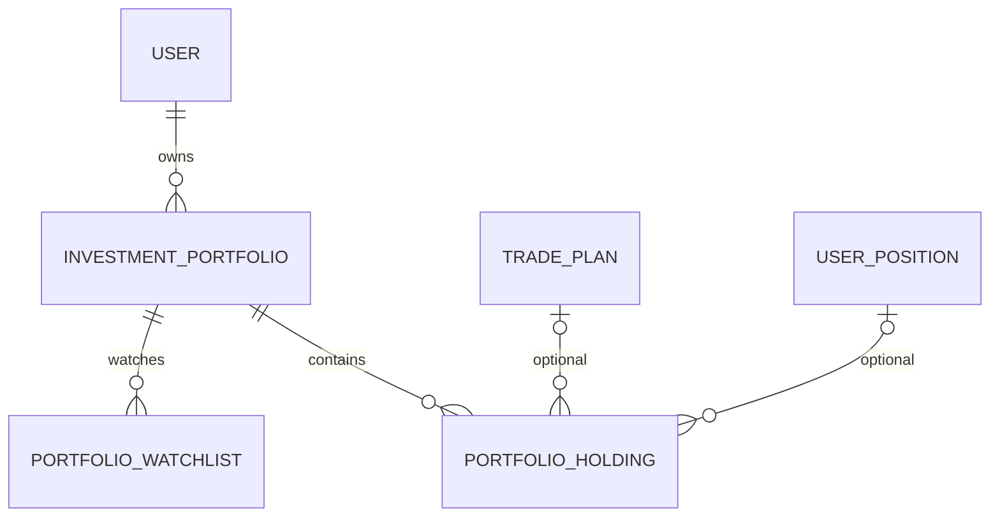

# Sprint 35：Portfolio Center Foundation

Trade Companion 0.9.7-beta 增加独立的用户投资中心。它只保存用户主动录入的事实，不是交易终端。

## 架构与模型

仓库已有 `portfolios`/`paper_positions`，用于早期内部纸面交易现金与成交模拟；Sprint 05 也已有
策略观察池 `watchlist_items`。它们和本模块语义不同，均保持原样。Portfolio Center 使用：

- `investment_portfolios`：用户、标准化名称、币种、ACTIVE/INACTIVE 和默认标志；
- `portfolio_holdings`：手工持仓事实，Decimal 数量/成本，生命周期仅 OPEN→CLOSED；
- `portfolio_watchlists`：Portfolio 内唯一的 Market+Symbol、稀疏 `display_order` 和备注。

**Portfolio Holding ≠ Broker Position。** Holding 可独立存在，也可选关联 Trade Plan 或 User
Position。创建/关闭 Holding 不创建或改变 Plan、Position、Review、AI、策略、通知或订单。

## Repository、Service 与 Statistics

三个 Repository 只负责 CRUD、查询、分页、排序和存在性。`PortfolioService`、`HoldingService`、
`WatchlistService` 统一执行业务校验和最小事务；Route/Dashboard 不直接写 ORM。
`PortfolioStatisticsService` 是唯一统计入口，仅返回 Holding/Watchlist 数量、方向和最早/最新时间。
不计算现金、市值、盈亏、收益率、CAGR、Sharpe 或 MDD。

Portfolio 不提供物理删除，只能软停用。默认 Portfolio 必须 ACTIVE；停用默认项会被拒绝，需先
切换默认项。Watchlist 行可单独物理删除。Trade Plan/User Position 外键使用 `ON DELETE SET NULL`；
Holding 历史不会级联删除。Portfolio 的 Watchlist 外键包含防御性 CASCADE，但业务层无 Portfolio
删除入口。

## API 与权限

公开文档中的只读 API：

- `GET /api/portfolios`
- `GET /api/portfolios/{id}`
- `GET /api/portfolios/{id}/holdings`
- `GET /api/holdings/{id}`
- `GET /api/portfolios/{id}/watchlist`
- `GET /api/portfolios/{id}/statistics`

内部管理员接口提供创建/更新/设默认、记录/关闭 Holding、更新备注和 Watchlist 管理，全部隐藏于
OpenAPI。当前项目没有可靠的普通 Web User Context，故普通用户访问 Fail Closed；管理员继续使用
现有 Dashboard Token。系统绝不从请求参数或未验证 Header 推断当前用户，未创建第二套认证。

## Dashboard 与 Formatter

`/dashboard/portfolios`、Portfolio 详情与单一 Holding 详情页面复用现有布局、Cookie/Token 和统一
Service。空状态可正常展示；页面不请求实时行情或 Broker，也无下单功能。

纯 Formatter 支持 Portfolio、Holding、Watchlist 和 Statistics 的中英文安全文本输入、Markdown
转义、Unicode 和长度限制。它不联网、不发送 Telegram、不访问行情或 AI。

## Migration 与当前限制

Migration `0019` 是基于 `0018` 的增量、可逆 SQLite Migration；不迁移旧纸面仓位、策略观察池或
User Position，不虚构默认 Portfolio。默认 Portfolio 采用 Lazy Creation。

当前没有 Broker 同步、实时仓位验证、当前价格、市值、盈亏、现金、汇率、收益率、自动 Review、
自动 AI、自动 Strategy、Scheduler、Telegram 发送或自动交易。未来普通用户身份接入后，可在不改变
模型边界的情况下开放自有 Portfolio 访问。
