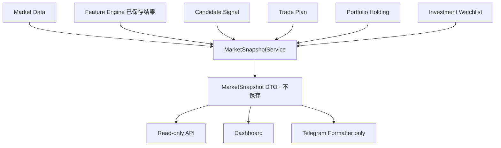

# Sprint 36：Watchlist Intelligence & Market Snapshot Foundation

## Goal 与架构位置

Trade Companion 0.9.8-beta 将 Investment Watchlist 升级为统一市场观察入口。Market Snapshot 不是
数据库实体、AI Analysis、Trade Plan 或 Portfolio；它只是在读取时生成的 Read Model。

## Snapshot DTO

DTO 包含 Symbol、Market、Display Name、最新已有 Bar 价格/时间、Strategy Status、Candidate、Trade
Plan、Holding、数量、加权平均成本、Investment Watchlist 状态、Feature 状态和更新时间。额外关联 ID
仅用于 Dashboard 跳转。

状态规则：已有 Plan 为 `ACTIVE`；否则已有有效 Candidate 为 `READY`；Investment Watchlist 中为
`WATCH`；完全无 Bar/Feature 为 `NO_DATA`；其余为 `UNKNOWN`。Candidate 只映射已有有效记录：
`CANDIDATE_BUY→BUY`、`CANDIDATE_EXIT/REDUCE→SELL`、`WATCH→WATCH`。

## Repository 与 Service

`MarketSnapshotRepository` 只读查询现有 ORM，并兼容 `SOXL` 与 `US.SOXL` 两种历史代码格式。
Universe 来自 Instrument、Investment Watchlist、OPEN Holding、Candidate Signal 和 Trade Plan 的并集；
Strategy Watchlist 不作为 Investment Watchlist 使用。

`MarketSnapshotService` 是唯一 DTO 构建入口，负责状态、过滤、分页、单次 Service 实例缓存和基于
Snapshot 集合的 Summary。API、Dashboard 和 Formatter 不自行拼装业务状态。没有 Redis、缓存表、
历史表、后台预计算或数据库写入。

## API、Dashboard 与 Formatter

只读 API：

- `GET /api/market-snapshots`
- `GET /api/market-snapshots/{symbol}`
- `GET /api/watchlists/{portfolio_id}/snapshots`

列表固定按 Symbol 升序，并支持白名单过滤与 `page/page_size`。Dashboard 提供 Snapshot 列表、详情
及 Portfolio Watchlist Snapshot，能够跳转已存在的 Trade Plan/Holding；没有 AI、Review、Broker
Position、实时盈亏或交易按钮。

Formatter 只格式化传入 DTO 或 Service Summary，支持 Markdown 转义、Unicode、Decimal 和长度限制；
不联网、不发送 Telegram，也不再次查询 Repository。

## Permission Model

沿用 Sprint 35。管理员使用现有 Dashboard Token；项目尚无可靠普通 Web User Context，因此普通
用户访问 Fail Closed。没有通过 `portfolio_id`、请求参数或未验证 Header 推断身份，也没有第二套
认证系统。

## Current Limitations

- Snapshot 使用数据库中最新已有 Bar，不主动获取实时行情；
- 不持久化、无历史、无跨请求缓存；
- 不计算 PnL、Return、Sharpe、MDD、现金或 Broker 资产；
- 不重新计算 Feature/Signal，不修改 Plan/Holding/Candidate；
- 不调用 AI、Broker、OpenD、Scheduler、Notification 或 Telegram Runtime。
