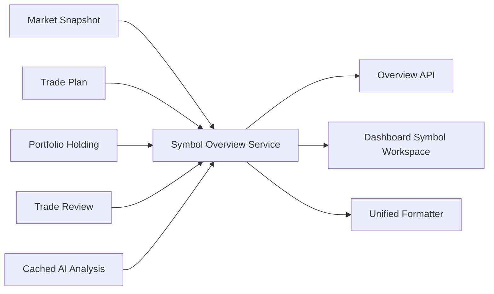

# Sprint 37 — Experience Integration & Product Workflow

Trade Companion 0.9.9-beta 将现有产品对象收敛到 Symbol Workspace。该层是即时生成的只读
Read Model，不是 ORM，不新增表，也不改变 Strategy、Trade Plan、Portfolio、Review 或 AI Provider。

`SymbolOverviewRepository` 只读取对象关系，不 flush、不 commit。`SymbolOverviewService` 复用
`MarketSnapshotService`，生成稳定 DTO。API 返回 Snapshot、最新关联对象、AI History 和可用链接；
Dashboard 保留原详情页并共享 Symbol Header 与 Related Objects。缺失对象统一显示 `Not Available`。

统一 AI 入口优先解释最终 Review，其次关联 User Position，最后 Trade Plan；生成全部委托已有
`CompanionService`。管理员入口默认 dry-run，不写库、不调用外部 Provider。

本 Sprint 没有 Migration、Broker、OpenD、Telegram 发送、Scheduler、策略计算或新 AI 能力。
