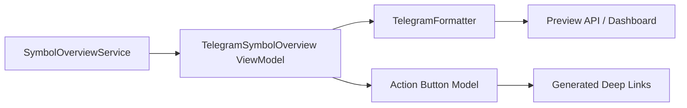

# Sprint 38 — Telegram Product Integration

Trade Companion 1.0.0-beta 提供纯 Telegram Presentation Layer。它只接收 Service DTO，不访问数据库、
Strategy、AI Provider、Broker、OpenD 或 Telegram API。

## 组成

- `TelegramSymbolOverview`：稳定的 `telegram-symbol-overview-v1` ViewModel。
- `TelegramPresenter`：中英文模板、Markdown 转义、Decimal 格式和 4,000 字符保护。
- `TelegramActionButton`：只描述 action、target 与 deep link，不执行 Callback。
- `TelegramFormatter`：统一 facade，并复用 Snapshot、Trade Plan、Portfolio、Holding、Review 和
  AI Companion 的已有 Formatter。
- Preview API 与 Dashboard 明确返回 `preview=true`、`sent=false`。

Deep Link 使用产品内部 `trade-companion://` URI，仅作为下一阶段 Telegram Runtime 的输入模型；
本 Sprint 不验证 BotFather 或真实客户端行为。

## 当前限制

没有 Bot Token、Polling、Webhook、Telegram HTTP API、Notification Runtime、Scheduler 或真实发送。
真实 Bot 联调留在 Windows 部署环境完成。
