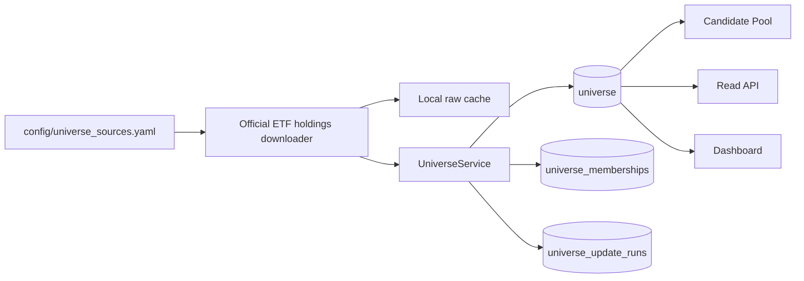

# Universe Engine

Universe Engine 是 Trade Companion 的证券白名单边界。Candidate Pool、后续 Quality Filter、
Mispricing、Recovery、Signal、Backtest 与 Telegram 选股流程只能消费 `universe.status=ACTIVE`
的证券，禁止直接扫描整个美股市场。

## 架构



`universe` 对 symbol 去重并保存公司元数据；`universe_memberships` 保存任意 ETF 的成员关系和权重；
`universe_update_runs` 保存更新结果。QQQ、SPY 是第一批配置，不是表结构中的固定上限。

## 更新规则

- 配置文件：`config/universe_sources.yaml`。
- 原始文件缓存：`data/cache/universe/`，不进入 Git。
- 新成分创建或恢复为 `ACTIVE`。
- 从某 ETF 删除时仅停用对应 membership；只有不属于任何已启用 ETF 时，证券才变为 `INACTIVE`。
- 历史记录永不因日常更新物理删除。
- 单一来源失败不会停用该来源的历史成分，运行状态为 `PARTIAL_SUCCESS` 或 `FAILED`。
- `UNIVERSE_AUTO_UPDATE_ENABLED=true` 时，应用以非重叠后台线程每日检查一次；默认启用，测试环境显式关闭且不联网。

手工更新：

```bash
python -m app.cli universe update
python -m app.cli universe list --fund QQQ --limit 100
```

## API 与 Dashboard

- `GET /universe`
- `GET /universe/active`
- `GET /universe/{symbol}`
- `POST /internal/universe/update`（管理员、OpenAPI 隐藏）
- `/dashboard/universe`

列表支持 `search`、`fund=QQQ|SPY|QQQ+SPY`、`sector`、`industry`、`status`、
排序、limit 和 offset。兼容字段 `qqq_member`、`spy_member`、`qqq_weight`、
`spy_weight` 由通用 membership 关系生成。

## 数据限制

ETF 官方持仓文件不一定提供 sector、industry 或 market cap。缺失时保存 `NULL`，绝不填 0 或猜测。
下载地址和文件格式可能由发行商调整；发生解析错误时会保留旧 Universe 并记录异常，需要更新配置或解析器。
